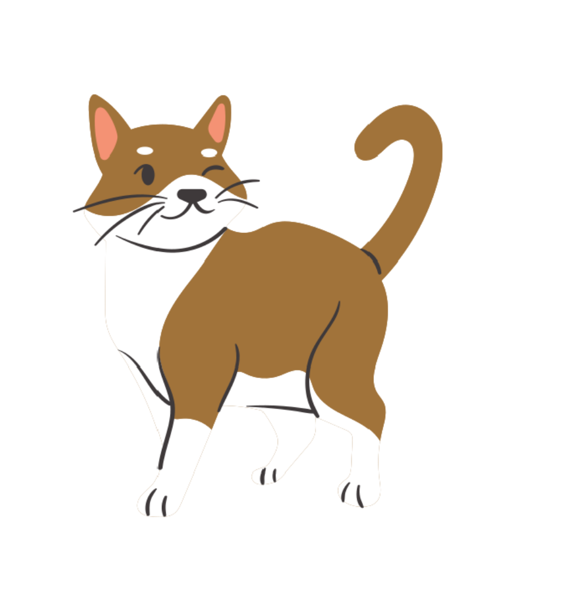
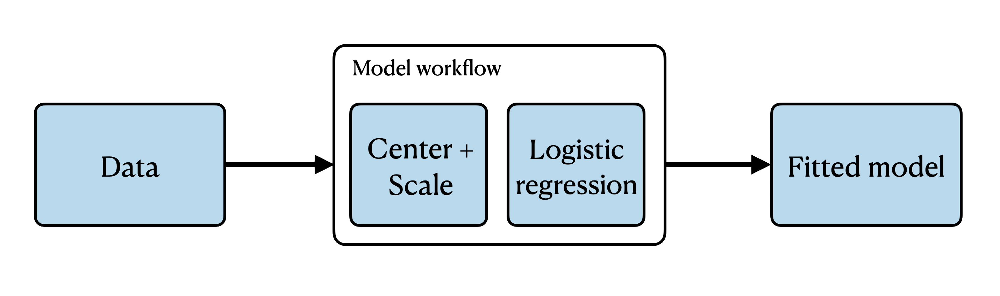

---
format:
  revealjs: 
    theme: [default, styles.scss]
    width: 1280
    height: 720
    include-in-header:
      text: |
        <script src="https://cdnjs.cloudflare.com/ajax/libs/animejs/3.2.2/anime.min.js"></script>
    include-after-body:
      - "all-the-js-code.html"
      - "js/infra.html"
      - "js/recipe-pipeline.html"
echo: false
code-line-numbers: false
pagetitle: Feature Engineering, Pfizer x Posit Summit 2026
knitr:
  opts_chunk:
    dev: png
    dev.args: { bg: "transparent" }
---

## Feature Engineering {.center .dark}

### Pfizer x Posit Summit 2026

Emil Hvitfeldt

{.absolute width=500.139px height=500.68px left=856px top=-124px}

{.absolute width=377.125px height=455.946px left=647.41px top=-108.144px}

{.absolute width=502.79px height=285.45px left=665.753px top=61.0849px}

## What is Feature Engineering?

::: fragment
::: r-fit-text
The act of modifying data  
to allow for easy  
[extraction of signal]{.pink-shadow} and  
[elimination of noise]{.blue-shadow} 
:::
:::

## {.dark}

::: {.speech .pink}
why do we use feature engineering?
:::

::: fragment
::: {.speech .purple .right}
most models can't handle non-numeric data
:::
:::

::: fragment
::: {.speech .blue}
and we often have non-numeric data
:::
:::

## {.dark}

::: {.speech .pink}
Are there other reason?
:::

::: fragment
::: {.speech .brown .right}
to deal with missing values
:::
:::

::: fragment
::: {.speech .blue .right}
and correlated features
:::
:::

::: fragment
::: {.speech .purple .right}
or deal with scaling issues
:::
:::

# {.dark}

::: {.r-fit-text style="transform: translateY(-15rem);"}
preprocessing vs feature engineering 
:::

{.absolute width=384.941px height=458.723px left=702.059px top=-121.723px}

{.absolute width=436.148px height=445.185px left=91.4391px top=-122.232px}

## 

::: {.columns}
::: {.column}

### Preprocessing

[what needs to happen]{.blue-text}

<br>

::: fragment
transformation

Normalization

Formatting

Imputing

Encoding
:::


:::
::: {.column}

### Feature engineering

[what helps capture signal]{.purple-text}

<br>

::: fragment
transformation

Normalization

Formatting

Imputing

Encoding
:::

:::
:::

## Where does feature engineering fit in?

. . .

{style="max-width: 95%; max-height: 95%;"}

## {recipes} package

extensible framework for pipeable sequences of feature engineering steps provides preprocessing tools to be applied to data

::: {.incremental .highlight-last}
- Modular + extensible
- pipeable
- Deferred evaluation
- Isolates test data from training data
- Can do things formulas can't
:::

## What is a recipe? {.dark}

:::{.mono}
recipe(sale_price ~ ., data = ames_training) |>  
\ \ step_unknown(all_nominal_predictors()) |>  
\ \ step_other(all_nominal_predictors()) |>  
\ \ step_dummy(all_nominal_predictors()) |>  
\ \ step_date(date_sold, features = c("month", "dow", "week")) |>  
\ \ step_zv(all_predictors()) |>  
\ \ step_normalize(all_numeric_predictors())
:::

## What is a recipe? {.dark}

:::{.mono}
[recipe(sale_price ~ ., data = ames_training)]{.purple} |>  
\ \ step_unknown(all_nominal_predictors()) |>  
\ \ step_other(all_nominal_predictors()) |>  
\ \ step_dummy(all_nominal_predictors()) |>  
\ \ step_date(date_sold, features = c("month", "dow", "week")) |>  
\ \ step_zv(all_predictors()) |>  
\ \ step_normalize(all_numeric_predictors())
:::

[Start by calling `recipe()` to denote the data source and variables used]{.purple}

## What is a recipe? {.dark}

:::{.mono}
recipe(sale_price ~ ., data = ames_training) |>  
\ \ [step_unknown]{.orange}(all_nominal_predictors()) |>  
\ \ [step_other]{.orange}(all_nominal_predictors()) |>  
\ \ [step_dummy]{.orange}(all_nominal_predictors()) |>  
\ \ [step_date]{.orange}(date_sold, features = c("month", "dow", "week")) |>  
\ \ [step_zv]{.orange}(all_predictors()) |>  
\ \ [step_normalize]{.orange}(all_numeric_predictors())
:::

[specifying what actions to take by adding `step_*()`s]{.orange}

## What is a recipe? {.dark}

:::{.mono}
recipe(sale_price ~ ., data = ames_training) |>  
\ \ step_unknown([all_nominal_predictors()]{.red}) |>  
\ \ step_other([all_nominal_predictors()]{.red}) |>  
\ \ step_dummy([all_nominal_predictors()]{.red}) |>  
\ \ step_date([date_sold]{.red}, features = c("month", "dow", "week")) |>  
\ \ step_zv([all_predictors()]{.red}) |>  
\ \ step_normalize([all_numeric_predictors()]{.red})
:::

[using {tidyselect} and recipes specific selectors to denote affected variables]{.red}

## What is a recipe? {.dark}

:::{.mono}
recipe(sale_price ~ ., data = ames_training) |>  
\ \ step_unknown(all_nominal_predictors()) |>  
\ \ step_other(all_nominal_predictors()) |>  
\ \ step_dummy(all_nominal_predictors()) |>  
\ \ step_date(date_sold, [features = c("month", "dow", "week")]{.green}) |>  
\ \ step_zv(all_predictors()) |>  
\ \ step_normalize(all_numeric_predictors())
:::

[many steps have options to modify behavior]{.green}

## {.rec-slide}

::: {.rec-stage-wrap}
<div id="rec-title" class="rec-title"></div>
<div id="rec-stage"></div>
:::

[]{.fragment .rec-frag id="rec-impute"}
[]{.fragment .rec-frag id="rec-unknown"}
[]{.fragment .rec-frag id="rec-dummy"}
[]{.fragment .rec-frag id="rec-normalize"}
[]{.fragment .rec-frag id="rec-pca"}
[]{.fragment .rec-frag id="rec-final"}

## Using a recipe {.dark}

[recipes are can be used with {workflows} to "combine" it with a model]{.citron}

::: {style="height: 115px;"}
:::

:::{.mono}
wf_spec <- workflow() |>  
\ \ [add_recipe(rec_spec)]{.citron} |>  
\ \ add_model(linear_reg())
:::

## recipes are estimated

Every preprocessing step in a recipe that involved  
calculations uses the *training* set. For example:

- Levels of a factor
- Determination of zero-variance
- Normalization
- Feature extraction

Once a a recipe is added to a workflow,  
this occurs when `fit()` is called.

## types of steps - trained {.dark}

:::{.mono}
recipe(sale_price ~ ., data = ames_training) |>  
\ \ step_unknown(all_nominal_predictors()) |>  
\ \ [step_other(all_nominal_predictors())]{.blue} |>  
\ \ step_dummy(all_nominal_predictors()) |>  
\ \ step_date(date_sold, features = c("month", "dow", "week")) |>  
\ \ step_zv(all_predictors()) |>  
\ \ step_normalize(all_numeric_predictors())
:::

[Levels not found in tranining data set are set to "unseen"]{.blue}

## types of steps - trained {.dark}

:::{.mono}
recipe(sale_price ~ ., data = ames_training) |>  
\ \ step_unknown(all_nominal_predictors()) |>  
\ \ step_other(all_nominal_predictors()) |>  
\ \ [step_dummy(all_nominal_predictors())]{.blue} |>  
\ \ step_date(date_sold, features = c("month", "dow", "week")) |>  
\ \ step_zv(all_predictors()) |>  
\ \ step_normalize(all_numeric_predictors())
:::

[records which levels are seen in training data set]{.blue}

## types of steps - trained {.dark}

:::{.mono}
recipe(sale_price ~ ., data = ames_training) |>  
\ \ step_unknown(all_nominal_predictors()) |>  
\ \ step_other(all_nominal_predictors()) |>  
\ \ step_dummy(all_nominal_predictors()) |>  
\ \ step_date(date_sold, features = c("month", "dow", "week")) |>  
\ \ [step_zv(all_predictors())]{.blue} |>  
\ \ step_normalize(all_numeric_predictors())
:::

[records which variables had zero variance]{.blue}

## types of steps - trained {.dark}

:::{.mono}
recipe(sale_price ~ ., data = ames_training) |>  
\ \ step_unknown(all_nominal_predictors()) |>  
\ \ step_other(all_nominal_predictors()) |>  
\ \ step_dummy(all_nominal_predictors()) |>  
\ \ step_date(date_sold, features = c("month", "dow", "week")) |>  
\ \ step_zv(all_predictors()) |>  
\ \ [step_normalize(all_numeric_predictors())]{.blue}
:::

[records mean and sd of variables]{.blue}

## types of steps - static {.dark}

:::{.mono}
recipe(sale_price ~ ., data = ames_training) |>  
\ \ [step_unknown(all_nominal_predictors())]{.pink} |>  
\ \ step_other(all_nominal_predictors()) |>  
\ \ step_dummy(all_nominal_predictors()) |>  
\ \ [step_date(date_sold, features = c("month", "dow", "week"))]{.pink} |>  
\ \ step_zv(all_predictors()) |>  
\ \ step_normalize(all_numeric_predictors())
:::

[these steps provide static transformations, and could thus be done outside before the recipe]{.pink}

## Extensive role selection {.dark}

All steps use {tidyselect} to select variables

:::{.mono}
... |>  
step_pca([BsmtFin_SF_1]{.orange}, [BsmtFin_SF_2]{.orange}, [Bsmt_Unf_SF]{.orange},  
\ \ \ \ \ \ \ \ \ [Total_Bsmt_SF]{.orange}, [First_Flr_SF]{.orange}, [Second_Flr_SF]{.orange},  
\ \ \ \ \ \ \ \ \ [Wood_Deck_SF]{.orange}, [Open_Porch_SF]{.orange},  
\ \ \ \ \ \ \ \ \ threshold = 0.8) |>  
...
:::

variables can be written out one by one

## Extensive role selection {.dark}

All steps use {tidyselect} to select variables

:::{.mono}
... |>  
step_pca([contains("SF")]{.orange}, threshold = 0.8) |>  
...
:::

using `tidyselect::contains()`

## Extensive role selection

All steps use {tidyselect} to select variables

:::{.mono}
... |>  
step_pca([contains("SF")]{.orange}, -[starts_with("Bsmt")]{.orange},  
\ \ \ \ \ \ \ \ \ threshold = 0.8) |>  
...
:::

or combine multiple {tidyselect} selectors

## Useful selectors - tidyselect

- `starts_with()`
- `ends_with()`
- `contains()`
- `matches()`
- `num_range()`
- `one_of()`
- `any_of()`

## Useful selectors - recipes

In addition to `all_predictors()` and `all_outcomes()`

::: columns
::: {.column width="50%"}
- [all_numeric()]{.green .code}
    - [all_double()]{.green .code}
    - [all_integer()]{.green .code}
- [all_logical()]{.pink .code}
- [all_date()]{.blue}
- [all_datetime()]{.red}
:::

::: {.column width="50%"}
- [all_nominal()]{.purple .code}
    - [all_string()]{.purple .code}
    - [all_factor()]{.purple .code}
    - [all_unordered()]{.purple .code}
    - [all_ordered()]{.purple .code}
    
all have `*_predictors()` variants
:::
:::

## Long Beach Animal Shelter Data {.dark}

```{r}
library(tidyverse)
library(janitor)
library(gt)

adoptions <- read_csv("data/animal-shelter-intakes-and-outcomes.csv") |>
  clean_names() |>
  filter(animal_type == "CAT")

adoptions |>
  head(n = 10) |>
  gt()
```

::: footer
<https://data.longbeach.gov/explore/dataset/animal-shelter-intakes-and-outcomes>
:::

## Your turn: Explore data set

Explore the `animalshelter::longbeach` data set, using whatever tools you prefer.



::: footer
<https://github.com/emilhvitfeldt/animalshelter>
:::

## Date Time {.dark}

How can we deal with this variable?

::::: {.columns}

::::: {.column width="20%"}
```{r}
adoptions |>
  select(intake_date) |>
  head(n = 10) |>
  gt()
```
:::::

::::: {.column width="80%"}
::: r-stack

::: {.fragment .fade-in-then-out}
```{r}
adoptions |>
  select(intake_date) |>
  transmute(intake_date_integer = as.integer(intake_date)) |>
  head(n = 10) |>
  gt()
```
:::

::: {.fragment .fade-in-then-out}
:::

::: {.fragment .fade-in-then-out}
```{r}
adoptions |>
  select(intake_date) |>
  transmute(
    intake_date_year = clock::get_year(intake_date),
    intake_date_month = clock::get_month(intake_date),
    intake_date_day = clock::get_day(intake_date)
  ) |>
  head(n = 10) |>
  gt()
```
:::

::: {.fragment .fade-in-then-out}
:::

::: {.fragment .fade-in-then-out}
```{r}
library(extrasteps)
library(almanac)

rules <- list(christmas = hol_christmas(), halloween = hol_halloween())

recipe(~ intake_date, data = adoptions) |>
  step_date_before(intake_date, rules = rules) |>
  prep() |>
  bake(NULL) |>
  head(n = 10) |>
  gt()
```
:::

::: {.fragment .fade-in-then-out}
```{r}
library(extrasteps)
library(almanac)

rules <- list(christmas = hol_christmas(), halloween = hol_halloween())

recipe(~ intake_date, data = adoptions) |>
  step_date_before(intake_date, rules = rules, transform = "log") |>
  prep() |>
  bake(NULL) |>
  head(n = 10) |>
  gt()
```
:::

:::
:::::
:::::

## Multiple Categorical variables {.dark}

How can we deal with these variables?

```{r}
adoptions |>
  select(primary_color, secondary_color) |>
  head(n = 10) |>
  gt()
```

## Multiple Categorical variables {.dark}

How can we deal with these variables? Create dummies

```{r}
adoptions |>
  select(primary_color, secondary_color) |>
  recipe() |>
  step_string2factor(primary_color) |>
  step_unknown(secondary_color) |>
  step_dummy(primary_color, secondary_color) |>
  prep() |>
  bake(NULL) |>
  head(n = 10) |>
  gt()
```

## Multiple Categorical variables {.dark}

How can we deal with these variables? othering of low counts

```{r}
adoptions |>
  select(primary_color, secondary_color) |>
  recipe() |>
  step_unknown(secondary_color) |>
  step_string2factor(primary_color) |>
  step_other(primary_color, secondary_color, threshold = 0.01, other = "OTHER") |>
  step_dummy(primary_color, secondary_color) |>
  prep() |>
  bake(NULL) |>
  head(n = 10) |>
  gt()
```

## Multiple Categorical variables {.dark}

How can we deal with these variables? combined dummies

```{r}
adoptions |>
  select(primary_color, secondary_color) |>
  recipe() |>
  step_unknown(secondary_color) |>
  step_string2factor(primary_color) |>
  step_dummy_multi_choice(primary_color, secondary_color, threshold = 0.019, other = "OTHER", prefix = "color") |>
  prep() |>
  bake(NULL) |>
  relocate(color_ORANGE, color_WHITE) |>
  head(n = 10) |>
  gt()
```

::: footer
<https://feaz-book.com/categorical-multi-dummy>
:::

## What will we go over?

::: {.columns}
::: {.column}

**Types of data**

- [numeric]{.fragment .highlight-purple fragment-index=1}
- [character]{.fragment .highlight-purple fragment-index=1}
  - factors
  - logical
- [Datetime]{.fragment .highlight-purple fragment-index=1}
- text
- image
- time series
- ... and more

:::
::: {.column}

**Data problems**

- [missing data]{.fragment .highlight-blue fragment-index=2}
- too many variables
- correlated variables
- [outliers]{.fragment .highlight-blue fragment-index=2}
- imbalanced
- ... and more
:::
:::

# numeric variables {.dark}

{.absolute width=776.708px height=287.697px left=-103.568px top=116.572px}

{.absolute width=253.461px height=405.037px left=870.72px top=37.2435px}

## {.dark}

::: {.speech .pink}
Aren't we done? we have numeric variables
:::

::: fragment
::: {.speech .blue .right}
They might still need improvements
:::
:::

::: fragment
::: {.speech .brown .right}
Distributional problems, scaling, outliers, non-linear effects 
:::
:::

## Distributional problems

::: {.spacer style="height:70%; text-align: right;"}

Think about how models are working

Very valid for count data

We **rarely** care whether a predictor is normal

:::

## A skewed distribution

```{r}
library(modeldata)

ames |>
  ggplot(aes(Lot_Area)) +
  geom_histogram(fill = "#ECC0CF", color = prismatic::clr_darken("#ECC0CF", 0.1), bins = 100) +
  theme_minimal(paper = "#FFFFFF00", base_size = 22) +
  labs(x = NULL, y = NULL)

```

## A logged skewed distribution

```{r}
library(modeldata)

ames |>
  ggplot(aes(log(Lot_Area))) +
  geom_histogram(fill = "#ECC0CF", color = prismatic::clr_darken("#ECC0CF", 0.1), bins = 100) +
  theme_minimal(paper = "#FFFFFF00", base_size = 22) +
  labs(x = NULL, y = NULL)
```

## A square rooted skewed distribution

```{r}
library(modeldata)

ames |>
  ggplot(aes(sqrt(Lot_Area))) +
  geom_histogram(fill = "#ECC0CF", color = prismatic::clr_darken("#ECC0CF", 0.1), bins = 100) +
  theme_minimal(paper = "#FFFFFF00", base_size = 22) +
  labs(x = NULL, y = NULL)
```

## Methods to alter distributions

::: columns
::: {.column width="50%"}
- Logarithms
- Square Roots
- [Box-Cox]{.fragment .highlight-blue fragment-index=1}
- Yeo-Johnson
:::

::: {.column width="50%"}
::: {.fragment fragment-index=1}
using MLE to estimate a transformation parameter [$\lambda$]{.purple-color} in the following equation that would optimize the normality of $x^*$

$$
x^* = \left\{
    \begin{array}{ll}
      \dfrac{x^\lambda - 1}{\lambda \tilde{x}^{\lambda - 1}}, & \lambda \neq 0 \\
      \tilde{x} \log x & \lambda = 0
    \end{array}
  \right.
$$
:::
:::
:::

::: footer
::: {.fragment fragment-index=1}
<https://feaz-book.com/numeric-boxcox>
:::
:::

## Scaling issues

::: {.spacer style="height:70%;"}

Think about how models are working

- [tree based]{.text-pink} models doesn't care
- [distance based]{.text-brown} models do

has **few downsides** to doing

will make interpretations slightly harder
:::

## Motivated example

```{r}
set.seed(1234)
two_groups <- bind_rows(
  tibble(group = "A", x = rnorm(100, 0, 10), y = rnorm(100, 0, 1)),
  tibble(group = "B", x = rnorm(100, 100, 10), y = rnorm(100, 10, 1))
)

two_groups |>
  ggplot(aes(x, y, color = group)) +
  geom_point() +
  theme_minimal(paper = "#FFFFFF00", base_size = 22) +
  labs(x = NULL, y = NULL) +
  guides(color = "none") +
  scale_color_manual(values = c("#DFD0C0", "#D1BCDC")) +
  xlim(c(-35, 135)) +
  ylim(c(-5, 15))
```

## Motivated example

```{r}
two_groups |>
  ggplot(aes(x, y, color = group)) +
  geom_point() +
  theme_minimal(paper = "#FFFFFF00", base_size = 22) +
  labs(x = NULL, y = NULL) +
  guides(color = "none") +
  scale_color_manual(values = c("#DFD0C0", "#D1BCDC", "#B5C7EB")) +
  geom_point(data = tibble(group = "C", x = 45, y = 12), size = 4) +
  xlim(c(-35, 135)) +
  ylim(c(-5, 15))
```

## Motivated example

```{r}
grid <- expand_grid(y = seq(-5, 15, length.out = 200), x = seq(-35, 135, length.out = 200)) |>
  mutate(distA = sqrt((x-0)^2 + (y-0)^2)) |>
  mutate(distB = sqrt((x-100)^2 + (y-10)^2)) |>
  mutate(group = if_else(distA < distB, "A", "B"))

two_groups |>
  ggplot(aes(x, y, color = group)) +
  geom_point() +
  theme_minimal(paper = "#FFFFFF00", base_size = 22) +
  labs(x = NULL, y = NULL) +
  guides(color = "none", fill = "none") +
  scale_color_manual(values = c("#DFD0C0", "#D1BCDC", "#B5C7EB")) +
  scale_fill_manual(values = c("#DFD0C0", "#D1BCDC", "#B5C7EB")) +
  geom_raster(data = grid, aes(fill = group), alpha = 0.5) +
  geom_point(data = tibble(group = "C", x = 45, y = 12), size = 4) +
  xlim(c(-35, 135)) +
  ylim(c(-5, 15))
```

## Motivated example

```{r}
two_groups |>
  ggplot(aes(x, y, color = group)) +
  geom_point() +
  theme_minimal(paper = "#FFFFFF00", base_size = 22) +
  labs(x = NULL, y = NULL) +
  guides(color = "none") +
  scale_color_manual(values = c("#DFD0C0", "#D1BCDC", "#B5C7EB")) +
  geom_point(data = tibble(group = "C", x = 45, y = 12)) +
  coord_fixed()
```

## Scaling Methods

All scaling methods are **trained** on our data

<br>

All are a variation on

$$
X_{scaled} = \dfrac{X - a}{b}
$$

<br>

either to change [magnitude]{.brown-text} of data, or its [range]{.purple-text}

## Scaling Methods

| Method        | Definition                                                               |
|----------------|--------------------------------------------------------|
| Max-Abs       | $X_{scaled} = \dfrac{X}{\text{max}(\text{abs}(X))}$                      |
| Normalization | $X_{scaled} = \dfrac{X - \text{mean}(X)}{\text{sd}(X)}$                  |
| Min-Max       | $X_{scaled} = \dfrac{X - \text{min}(X)}{\text{max}(X) - \text{min}(X)}$  |
| Robust        | $X_{scaled} = \dfrac{X - \text{median}(X)}{\text{Q3}(X) - \text{Q1}(X)}$ |

::: footer
<https://feaz-book.com/numeric#sec-numeric-scaling-issues>
:::

## Dealing with outliers

<br>

What are outliers?

<br>

::: fragment

::: r-fit-text
values that are [substantially different]{.blue-text}  
from the rest of the values
:::

:::

## Dealing with outliers

<br>

1. [Identify them]{.pink-text}
    a. expert knowledge
    b. (not recommended) thresholding
2. [Dealing with them]{.blue-text}
    a. removal
    b. imputation
    c. indication

## Non-linear effects

::: {.spacer style="height:70%;"}

Doing a linear effect, we have that when the predictor [increases in value]{.brown-text}, the outcome [increases in value]{.brown-text}

non-linear effects don't have this property

[depending on the type of model]{.pink-text}, having linear effects are nice
:::

## Non-linear example

```{r}
set.seed(1234)
data_toy <- tibble::tibble(
  Predictor = rnorm(100) + 1:100
) |>
  dplyr::mutate(Outcome = sin(Predictor/25) + rnorm(100, sd = 0.1) + 10)
```

```{r}
data_toy |>
  ggplot(aes(Predictor, Outcome)) +
  geom_point() +
  theme_minimal(paper = "#FFFFFF00", base_size = 22) +
  theme(axis.text = element_blank())
```

## Non-linear example - distance to maximum

```{r}
data_toy |>
  mutate(Color = abs(Predictor - Predictor[max(Outcome) == Outcome])) |>
  ggplot(aes(Predictor, Outcome, color = Color)) +
  geom_point() +
  theme_minimal(paper = "#FFFFFF00", base_size = 22) +
  theme(axis.text = element_blank()) +
  scale_color_gradient(
    high = "#E0E0E0", 
    low = prismatic::clr_darken("#B5C7EB") |> prismatic::clr_saturate()
  ) +
  guides(color = "none")
  
```

## Non-linear example - splines

```{r}
rec_splines <- recipe(Outcome ~ Predictor, data = data_toy) |>
  step_bs(Predictor, keep_original_cols = TRUE, degree = 7) |>
  prep()

data_splines <- rec_splines |>
  bake(new_data = data_toy) |>
  select(-Predictor_bs_7) |>
  rename_all(\(x) {stringr::str_replace(x, "Predictor_bs_", "Spline Feature ")})

data_splines |>
  tidyr::pivot_longer(cols = -c(Outcome, Predictor)) |>
  ggplot(aes(Predictor, Outcome, color = value)) +
  geom_point() +
  facet_wrap(~name) +
  scale_color_gradient(
    low = "#E0E0E0", 
    high = prismatic::clr_darken("#B5C7EB") |> prismatic::clr_saturate()
  ) +
  theme_minimal(paper = "#FFFFFF00", base_size = 22) +
  guides(color = "none") +
  theme(axis.text = element_blank())
```

::: footer
<https://feaz-book.com/numeric-splines>
:::

## Basis Spline Features

```{r}
data_splines |>
  select(-Outcome) |>
  tidyr::pivot_longer(cols = -Predictor) |>
  ggplot(aes(Predictor, value)) +
  geom_line() +
  facet_wrap(~name) +
  theme_minimal(paper = "#FFFFFF00", base_size = 22) +
  theme(axis.text = element_blank())
```

::: footer
<https://feaz-book.com/numeric-splines>
:::

## Monotone Spline Features

```{r}
rec_splines <- recipe(Outcome ~ Predictor, data = data_toy) |>
  step_spline_monotone(Predictor, keep_original_cols = TRUE, degree = 7) |>
  prep()

data_splines <- rec_splines |>
  bake(new_data = data_toy) |>
  select(-c(Predictor_07:Predictor_10)) |>
  rename_all(\(x) {stringr::str_replace(x, "Predictor_0", "Spline Feature ")})

data_splines |>
  select(-Outcome) |>
  tidyr::pivot_longer(cols = -Predictor) |>
  ggplot(aes(Predictor, value)) +
  geom_line() +
  facet_wrap(~name) +
  theme_minimal(paper = "#FFFFFF00", base_size = 22) +
  theme(axis.text = element_blank())
```

::: footer
<https://feaz-book.com/numeric-splines>
:::


## Your turn: Dealing with numerics

::: {.columns}
::: {.column width="35%"}

Apply some of the methods we have learned so far to the data set

:::
::: {.column width="65%"}

Distribution: `step_log/sqrt/BoxCox/YeoJohnson()`

Scaling: `step_normalize()`

Splines: `step_spline_b()`

:::
:::



# Categorical Variables {.dark}

{.absolute width=495.528px height=287.546px left=-72.417px top=-4.6679px}

{.absolute width=422.185px height=394.978px left=790.24px top=-334.572px}

## {.dark}

::: {.speech .pink}
Dealing with categorical variables are easy right?
:::

::: fragment
::: {.speech .blue .right}
Yes and no, there are some unique struggles with categoricals
:::
:::

::: fragment
::: {.speech .brown .right}
and there are lots of methods to turn them into numeric
:::
:::

## Character vs Factor variables

<br>

::: columns
::: {.column width="50%"}
### Character

<br>

[Free form text]{.brown-text}

<br>

no restrictions
:::

::: {.column width="50%"}
### Factor

<br>

[Know possible values]{.purple-text}

<br>

A logical variables is conceptually a factor
:::
:::

## Factor Examples - sex {.dark}

::: columns
::: {.column width="50%"}
```{r}
adoptions |>
  count(sex) |>
  gt()
```
:::

::: {.column width="50%"}

::: fragment
Lot of information cramped in here

We could have it split into `sex` and `spayed/neutered`
:::

:::
:::

## Factor Examples - intake_condition {.dark}

::: columns
::: {.column width="50%"}
```{r}
adoptions |>
  count(intake_condition) |>
  slice(1:8) |>
  gt()
```
:::

::: {.column width="50%"}
```{r}
adoptions |>
  count(intake_condition) |>
  slice(9:16) |>
  gt()
```
:::
:::

## Character Examples - promary color {.dark}

::: columns
::: {.column width="33%"}
```{r}
adoptions |>
  count(primary_color) |>
  slice(1:20) |>
  gt()
```
:::

::: {.column width="33%"}
```{r}
adoptions |>
  count(primary_color) |>
  slice(21:40) |>
  gt()
```
:::

::: {.column width="33%"}
```{r}
adoptions |>
  count(primary_color) |>
  slice(41:60) |>
  gt()
```
:::
:::

## Character Examples - animal name {.dark}

```{r}
pet_names <- adoptions |>
  drop_na(animal_name) |>
  mutate(animal_name = str_remove(animal_name, "\\*")) |>
  filter(animal_id != animal_name) |>
  filter(str_detect(animal_name, "\\d", negate = TRUE)) |>
  filter(str_detect(animal_name, "^\\s*$", negate = TRUE)) |>
  count(animal_name, sort = TRUE)
```

::: columns
::: {.column width="33%"}
```{r}
pet_names |>
  slice(1:20) |>
  gt()
```
:::

::: {.column width="33%"}
```{r}
pet_names |>
  slice(21:40) |>
  gt()
```
:::

::: {.column width="33%"}
```{r}
pet_names |>
  slice(41:60) |>
  gt()
```
:::
:::

## Character Examples - animal name {.dark}

```{r}
long_pet_names <- pet_names |>
  filter(n == 1) |>
  mutate(animal_name = str_remove_all(animal_name, "\\*")) |>
  arrange(desc(nchar(animal_name)))
```

::: columns
::: {.column width="50%"}
```{r}
long_pet_names |>
  slice(1:10) |>
  gt()
```
:::

::: {.column width="50%"}
```{r}
long_pet_names |>
  slice(11:20) |>
  gt()
```
:::
:::

## Messy Characters

::: {.spacer style="height:70%;"}
Missing values

Inconsistent encoding

Typos

::: fragment
Best dealt with manually
:::
:::

## Unseen Levels

<br>

::: {.spacer style="height:50%;"}

Only applicable for [character variables]{.blue-text}

Will depend on [method]{.pink-text} and [models]{.pink-text}

:::

## How to deal with Categorical variables

<br>

Non-exhaustive list of methods

<br>

- label / ordinal encoding
- dummy encoding
- frequency encoding
- target encoding

## Label / Ordinal Encoding

::: {.spacer style="height:70%;"}

You take the categorical variable

Give each level a number

Replace level with said number

::: fragment
This is unlikely to work well unless done with care
:::
:::

::: footer
<https://feaz-book.com/categorical-label>
:::

## Label / Ordinal Encoding - Example {.dark}

```{r}
adoptions |>
  select(sex_before = sex, intake_type_before = intake_type) |>
  mutate(sex_after = sex_before, intake_type_after = intake_type_before) |>
  recipe() |>
  step_integer(sex_after, intake_type_after) |>
  prep() |>
  bake(NULL) |>
  slice(1:12) |>
  gt()
```

## Dummy Encoding

A variable is created for each possible level in categorical variables

They take value 1 when they original variable takes the value, 0 otherwise

::: fragment
::: columns
::: {.column width="50%"}
**pros**

- easy to use and interpret
- Versatile
- base on many other methods
:::

::: {.column width="50%"}
**cons**

- Needs clean levels
- Can create many columns
- Not likely most efficient representation

:::
:::
:::

::: footer
<https://feaz-book.com/categorical-dummy>
:::

## Dummy vs One-Hot Encoding

The terms dummy encoding and one-hot encoding get thrown around interchangeably, but they do have different and distinct meanings. 

<br>

One-hot encoding returns k variables

<br>

Dummy Encoding returns k-1 variables

<br>

Dummy encoding is preferred to avoid redundant data

## Dummy Encoding - Example {.dark}

```{r}
adoptions |>
  select(sex, intake_type) |>
  recipe() |>
  step_string2factor(sex, intake_type) |>
  step_dummy(sex, intake_type) |>
  prep() |>
  bake(NULL) |>
  slice(1:12) |>
  gt()
```

## Frequency Encoding

For each level calculate how often it appears

<br>

replace the level with that value

<br>

Can be raw count or percentage (doens't matter much)

::: footer
<https://feaz-book.com/categorical-frequency>
:::

## Frequency Encoding - Example {.dark}

```{r}
adoptions |>
  select(sex_before = sex, intake_type_before = intake_type) |>
  mutate(sex_after = sex_before, intake_type_after = intake_type_before) |>
  recipe() |>
  extrasteps::step_encoding_frequency(sex_after, intake_type_after) |>
  prep() |>
  bake(NULL) |>
  slice(1:12) |>
  gt()
```

## Target Encoding

also called mean encoding, likelihood encoding, or impact encoding

<br>

done by replacing each level of a categorical variable with the [mean of the target variable]{.pink-text} within said level

<br>

The target variable will typically be the outcome, but that is not necessarily a requirement.

::: footer
<https://feaz-book.com/categorical-target>
:::

## Target Encoding - Example {.dark}

```{r}
adoptions |>
  select(sex_before = sex, intake_type_before = intake_type, outcome_type) |>
  mutate(sex_after = sex_before, intake_type_after = intake_type_before) |>
  recipe() |>
  step_string2factor(sex_after) |>
  embed::step_lencode(sex_after, intake_type_after, outcome = vars(outcome_type), smooth = FALSE) |>
  prep() |>
  bake(NULL) |>
  slice(1:12) |>
  gt()
```

## Your turn: Work on categorical sections

::: {.columns}
::: {.column width="35%"}

Apply some of the methods we have learned so far to the data set

:::
::: {.column width="65%"}

Label encoding: `step_integer()`

Dummy encoding: `step_dummy()`

frequency encoding: `extrasteps::step_encoding_frequency()`

target encoding: `embed::step_lencode()`, `embed::step_lencode_glm/mixed/bayes()`

:::
:::



# Date time variables {.dark}

{.absolute width=842.708px height=544.089px left=175.48px top=88.4244px}

## Date time variables

How can we represent the date column `intake_date` for our model?

. . .

When we use a date column in its native format, most models in R convert it to an integer.

. . .

We can re-engineer it as:

- Days since a reference date
- Day of the week
- Month
- Year
- Indicators for holidays

## `intake_date` date features

using `step_date( features = c("year", "month", "dow", "decimal", "mday", "doy", "week", "semester", "quarter"))`

```{r}
#| label: step-date
#| echo: false
library(animalshelter)

recipe(~intake_date, data = longbeach) |>
  step_date(
    intake_date,
    features = c(
      "year",
      "month",
      "dow",
      "decimal",
      "mday",
      "doy",
      "week",
      "semester",
      "quarter"
    )
  ) |>
  prep() |>
  bake(NULL) |>
  slice(c(2000, 4000, 6000, 8000, 10000)) |>
  rename_with(\(x) stringr::str_remove(x, "intake_date_")) |>
  knitr::kable()
```

::: footer
<https://feaz-book.com/datetime-extraction>
:::

## `intake_date` date features

Adding `label = FALSE`

```{r}
#| label: step-date-label-false-table
#| echo: false
recipe(~intake_date, data = longbeach) |>
  step_date(
    intake_date,
    label = FALSE,
    features = c(
      "year",
      "month",
      "dow",
      "decimal",
      "mday",
      "doy",
      "week",
      "semester",
      "quarter"
    )
  ) |>
  prep() |>
  bake(NULL) |>
  slice(c(2000, 4000, 6000, 8000, 10000)) |>
  rename_with(\(x) stringr::str_remove(x, "intake_date_")) |>
  knitr::kable()
```

## Other recipes steps

- [`step_time()`](https://recipes.tidymodels.org/reference/step_date.html)

Works the same as `step_date()` but for measurements smaller than day: hour, hour12, am/pm, minute, second, decimal_day.

- [`step_holiday()`](https://recipes.tidymodels.org/reference/step_holiday.html)

Adds indicators for holidays. See `timeDate::listHolidays()` for supported holidays.

## dates as numerics

```{r}
#| label: step-date-label-false
#| echo: false
recipe(~intake_date, data = longbeach) |>
  step_date(
    intake_date,
    label = FALSE,
    features = c(
      "year",
      "month",
      "dow",
      "decimal",
      "mday",
      "doy",
      "week",
      "semester",
      "quarter"
    )
  ) |>
  prep() |>
  bake(NULL) |>
  rename_with(\(x) stringr::str_remove(x, "intake_date_")) |>
  select(intake_date, month, dow, mday) |>
  distinct() |>
  pivot_longer(-intake_date) |>
  ggplot(aes(intake_date, value)) +
  geom_col() +
  facet_grid(name ~ ., scales = "free_y") +
  theme_minimal(paper = "#FFFFFF00", base_size = 22)
```

## holidays as numerics

```{r}
#| label: step-holiday
#| echo: false
recipe(~ intake_date, data = longbeach) |>
  step_holiday(intake_date) |>
  prep() |>
  bake(NULL) |>
  rename_with(\(x) stringr::str_remove(x, "intake_date_")) |>
  distinct() |>
  pivot_longer(-intake_date) |>
  ggplot(aes(intake_date, value)) +
  geom_col() +
  facet_grid(name ~ ., scales = "free_y") +
  theme_minimal(paper = "#FFFFFF00", base_size = 22)
```

## What are the issues with these features?

The numeric features make it easy to capture the end or beginning, but harder to do anything more granular.

The indicators mostly care about the day itself. No information about the lead-up or aftermath

## time events

Using `extrasteps::step_time_event()` and the [almanac](https://davisvaughan.github.io/almanac/index.html) package, we can create useful time features.

```{r}
#| label: almanac
library(almanac)

rule_1 <- weekly() |>
  recur_on_weekdays() |>
  rsetdiff(hol_christmas())

rule_2 <- monthly(since = "2000-01-01") |>
  recur_on_interval(3) |>
  recur_on_day_of_month(1)

rule_3 <- yearly("1997-06-05") |>
  recur_on_day_of_week("Thursday") |>
  recur_on_month_of_year(c("Jun", "July", "Aug"))
```

## `step_time_event()`

Create a list of rules (last slide) and pass them to the `rules` argument of [`extrasteps::step_time_event()`](https://emilhvitfeldt.github.io/extrasteps/reference/step_time_event.html)

```{r}
#| label: step-time-event
#| eval: false
rules <- list(rule_1 = rule_1, rule_2 = rule_2, rule_3 = rule_3)

recipe(~intake_date, data = longbeach) |>
  step_time_event(intake_date, rules = rules)
```

## `step_time_event()` as numerics

```{r}
#| label: step-time-event-figure
#| echo: false
rules <- list(rule_1 = rule_1, rule_2 = rule_2, rule_3 = rule_3)

recipe(~intake_date, data = longbeach) |>
  step_time_event(intake_date, rules = rules, keep_original_cols = TRUE) |>
  prep() |>
  bake(NULL) |>
  rename_with(\(x) stringr::str_remove(x, "intake_date_")) |>
  distinct() |>
  pivot_longer(-intake_date) |>
  ggplot(aes(intake_date, value)) +
  geom_col() +
  facet_grid(name ~ ., scales = "free_y") +
  theme_minimal(paper = "#FFFFFF00", base_size = 22)
```

## Non-indicator time events

These features still have the issue that they only attach value to the date itself.

We can attach values based on how far we are away from those dates.

- [`step_date_before()`](https://emilhvitfeldt.github.io/extrasteps/reference/step_date_before.html)
- [`step_date_after()`](https://emilhvitfeldt.github.io/extrasteps/reference/step_date_after.html)
- [`step_date_nearest()`](https://emilhvitfeldt.github.io/extrasteps/reference/step_date_nearest.html)

::: footer
<https://feaz-book.com/datetime-advanced>
:::

## `step_date_before()`

```{r}
#| label: step-date-before
#| echo: false
rules <- list(rule_1 = rule_1, rule_2 = rule_2, rule_3 = rule_3)

recipe(~intake_date, data = longbeach) |>
  step_mutate(intake_date0 = intake_date) |>
  step_date_before(intake_date0, rules = rules) |>
  prep() |>
  bake(NULL) |>
  rename_with(\(x) stringr::str_remove(x, "intake_date0_")) |>
  distinct() |>
  pivot_longer(-intake_date) |>
  ggplot(aes(intake_date, value)) +
  geom_col() +
  facet_grid(name ~ ., scales = "free_y") +
  theme_minimal(paper = "#FFFFFF00", base_size = 22)
```

## `step_date_before()` - inverse

```{r}
#| label: step-date-before-inverse
#| echo: false
rules <- list(rule_1 = rule_1, rule_2 = rule_2, rule_3 = rule_3)

recipe(~intake_date, data = longbeach) |>
  step_mutate(intake_date0 = intake_date) |>
  step_date_before(intake_date0, rules = rules, transform = "inverse") |>
  prep() |>
  bake(NULL) |>
  rename_with(\(x) stringr::str_remove(x, "intake_date0_")) |>
  distinct() |>
  pivot_longer(-intake_date) |>
  ggplot(aes(intake_date, value)) +
  geom_col() +
  facet_grid(name ~ ., scales = "free_y") +
  theme_minimal(paper = "#FFFFFF00", base_size = 22)
```

## `step_date_after()` - inverse

```{r}
#| label: step-date-after-inverse
#| echo: false
rules <- list(rule_1 = rule_1, rule_2 = rule_2, rule_3 = rule_3)

recipe(~intake_date, data = longbeach) |>
  step_mutate(intake_date0 = intake_date) |>
  step_date_after(intake_date0, rules = rules, transform = "inverse") |>
  prep() |>
  bake(NULL) |>
  rename_with(\(x) stringr::str_remove(x, "intake_date0_")) |>
  distinct() |>
  pivot_longer(-intake_date) |>
  ggplot(aes(intake_date, value)) +
  geom_col() +
  facet_grid(name ~ ., scales = "free_y") +
  theme_minimal(paper = "#FFFFFF00", base_size = 22)
```

## `step_date_nearest()` - inverse

```{r}
#| label: step-date-nearest-inverse
#| echo: false
rules <- list(rule_1 = rule_1, rule_2 = rule_2, rule_3 = rule_3)

recipe(~intake_date, data = longbeach) |>
  step_mutate(intake_date0 = intake_date) |>
  step_date_nearest(intake_date0, rules = rules, transform = "inverse") |>
  prep() |>
  bake(NULL) |>
  rename_with(\(x) stringr::str_remove(x, "intake_date0_")) |>
  distinct() |>
  pivot_longer(-intake_date) |>
  ggplot(aes(intake_date, value)) +
  geom_col() +
  facet_grid(name ~ ., scales = "free_y") +
  theme_minimal(paper = "#FFFFFF00", base_size = 22)
```

## Datetime features

Avoid crafting datetime features by hand if at all possible.

Dealing with uneven month lengths, leap days (leap seconds)

Or tried to define any event that doesn't land on the same day of the week or date each year.

> The first Sunday after the first full moon on or after the vernal equinox

## Your turn: work on date times

::: {.columns}
::: {.column width="35%"}

Apply some of the methods we have learned so far to the data set

:::
::: {.column width="65%"}

Extraction: `step_date()`

Special days: `step_holiday()`

nearby: `extrasteps::step_date_before/after/nearest()`

:::
:::



# Want to learn more? {.dark}

My WIP Book: Feature Engineering A-Z

<https://feaz-book.com/>

Finished books by other people:

- Python Feature Engineering Cookbook
- Feature Engineering Bookcamp
- Feature Engineering and Selection

{.absolute width=692.753px height=638.144px left=698.247px top=72px}
